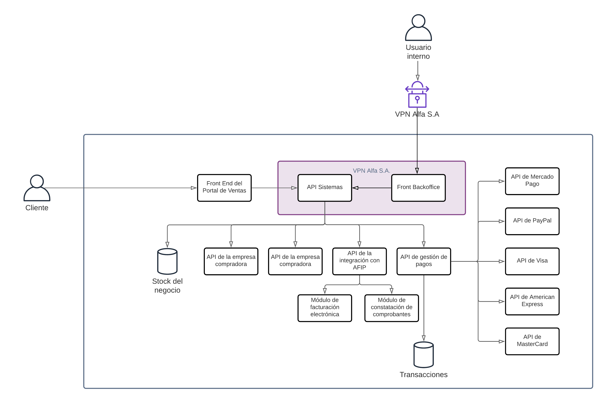
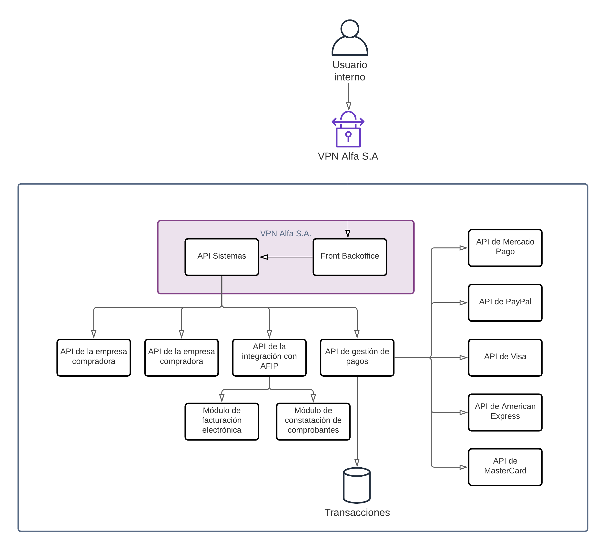
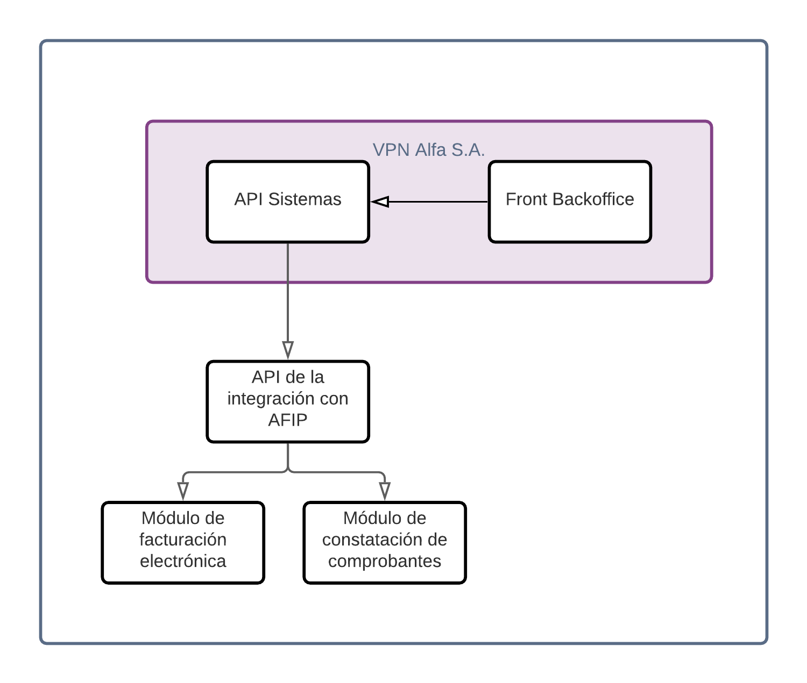

# Documento de arquitectura de software

## Tabla de contenidos
- [Documento de Arquitectura de Software](#Documento-de-Arquitectura-de-Software)
- [Diagrama General](#Diagrama-General)
- [Diagrama de Gestión de Pagos](#Diagrama-de-Gestión-de-Pagos)
- [Diagrama de Integración con AFIP](#Diagrama-de-Integración-con-AFIP)

## Documento de Diseño de Arquitectura
Este documento tiene como objetivo diagramar y explicar en detalle el diseño de la arquitectura de software de la nueva solución.

## Diagrama General

Este diagrama cuenta con 2 frontends. El primero va a ser el portal de ventas, que va a permitir a los usuarios realizar compras online. El segundo va a ser un backoffice que permitirá a los empleados de la empresa realizar operaciones administrativas sobre el sistema. Ambas interfaces se conectarán a una sola API general que se va a encargar de redireccionar todas las peticiones a las distintas APIs que componen el sistema. 
Además, esta API general va a exponer toda la información de producción, compras y ventas para realizar auditorías. 
A su vez, contará con una base de datos MySQL para llevar todo el control de stock del negocio, permitiendo realizar modificaciones manuales al mismo y realizar un manejo automático de la administración de las ventas online, ya sea por el portal propio o por los portales de ventas externos. Inicialmente el sistema solo va a estar conectado con Mercado Libre como portal de ventas externo, utilizando la API provista por la empresa. Esta conexión va a permitir la alta, baja y modificación de publicaciones, proveyendo una interfaz para el usuario administrativo. También contará con una integración con la API de gestión de pagos (explicado en su propio diagrama) y una integración con AFIP (explicado en su propio diagrama).

## Diagrama de Gestión de Pagos

La API de gestión de pagos contará con una base de datos MySQL para almacenar toda la información que respecta a las ventas de productos (facturas, remitos y comprobantes de pago). 
Esta API funcionará utilizando el patrón de adapter para conectarse con todos los brokers de pagos, de esta forma se le expondrá a la API general del sistema una única interfaz común. Con cada transacción que se realice, se guardará en la base de datos la información que corresponda. A su vez, esta API expondrá toda la información de la facturación anterior permitiendo realizar controles de auditoría e informes diarios.

## Diagrama de Integración con AFIP

La API de gestión de AFIP funcionará utilizando el patrón adapter para conectarse con los módulos de facturación electrónica y constatación de comprobantes. De esta forma, en caso de que se quiera integrar con nuevos módulos de AFIP, esta integración será mucho más fácil y no requerirá un cambio completo del sistema. A su vez, esta arquitectura permite la expansión internacional de la empresa ya que, si se desea integrar con facturación electrónica en otro país, se requerirán cambios mínimos a la solución planteada.
Esta API expondrá los medios para realizar facturas electrónicas y constatar comprobantes.
